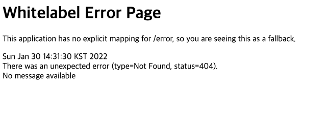

# TGS 프로젝트 Backend

### :gear: 프로젝트 환경 설정

#### :pencil2: 사전 준비 사항

- <a href="https://www.oracle.com/kr/java/technologies/javase/jdk11-archive-downloads.html">Java 11</a> 버전 다운로드 및 환경 변수 세팅


#### :computer: 프로젝트 실행 방법

1. 프로젝트 Clone 받기

```bash
$ git clone 
```


2. 프로젝트 Root 폴더에서 Gradle Wrapper로 Spring Boot 프로젝트 실행 *(./gradlew 명령어가 동작하지 않을 경우, git bash 터미널에서 실행해주세요)*

```bash
$ ./gradlew bootRun
```


3. http://localhost:8080 으로 접속했을 시, 아래와 같은 화면이 뜨면 접속 성공! (추후 수정 예정입닏자)


